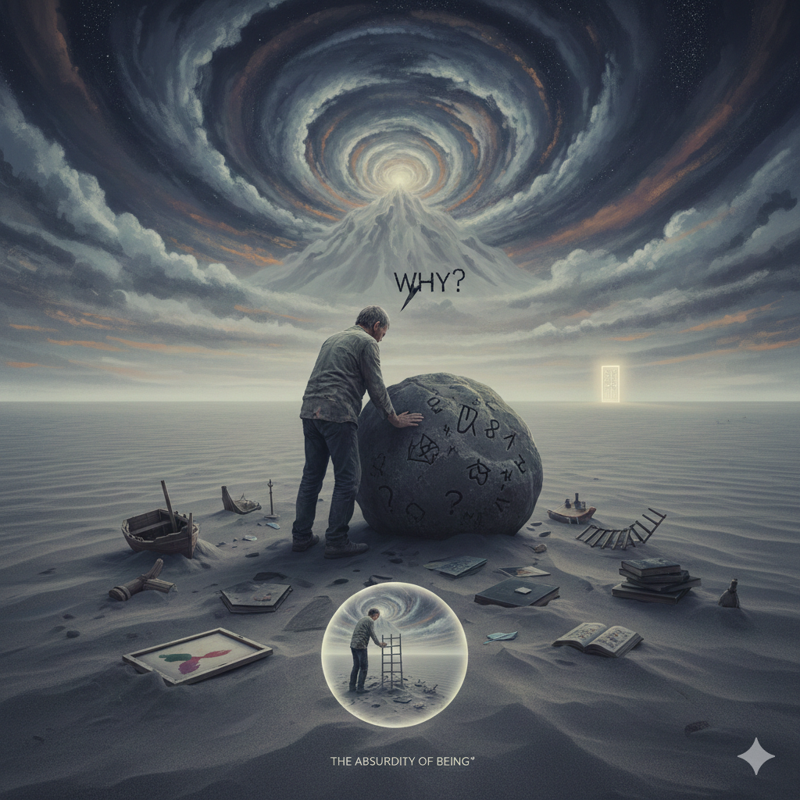
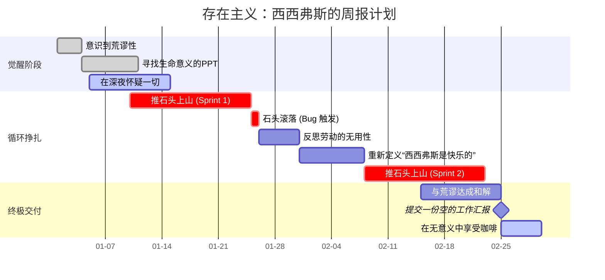

  

> **Wo der Wille ist, ist ein Weg.**  
> *Where there’s a will, there’s a way.*

## &#x1f517; 在线链接

---

## 👨‍💻 About Me
- 📝 **Wine and flowers are as of old, but the youthful heart has faded.**
- 💻 Experienced with **WPF** for modern desktop applications and **WinAppDriver** for UI automation.
- 🏸 **Badminton** enthusiast
- 🎨 Enjoy painting in my spare time
- ⛰️ I have a passion for scaling mountains. 

## 🌱 Currently Exploring

- Optimizing UI test automation with WinAppDriver.
- Philosophy involves **Buddhism**, and existentialism in particular. I'm pondering questions like **existence precedes essence** and what constitutes the **absurd**.
<!---->

**Operating System**  

  

**coding language**  

---
## &#x1f4ca; 技能评估

| 技能类别 | 具体技能 | 熟练程度 |
|---------|---------|---------|
| AGI | Gemini | &#x2b50;&#x2b50;&#x2b50;&#x2b50;&#x2b50; |
| 前端框架 | Flask | &#x2b50;&#x2b50; |
| 桌面应用 | WPF | &#x2b50;&#x2b50;&#x2b50; |
| IDE | vs code | &#x2b50;&#x2b50;&#x2b50;&#x2b50;&#x2b50; |
| 编程语言 | Python | &#x2b50;&#x2b50;&#x2b50;&#x2b50;&#x2b50;&#x2b50; |
| 编程语言 | C# | &#x2b50;&#x2b50;&#x2b50;&#x2b50;&#x2b50; |

## &#x1f4de; Connect with Me

- **QQ**: 1368219312
- **邮箱**: 1368219312@qq.com
- **电话**: 18321120471
---

*Let’s connect and build something amazing together!*

<!--
**ZebinGao/ZebinGao** is a ✨ _special_ ✨ repository because its `README.md` (this file) appears on your GitHub profile.
-->
